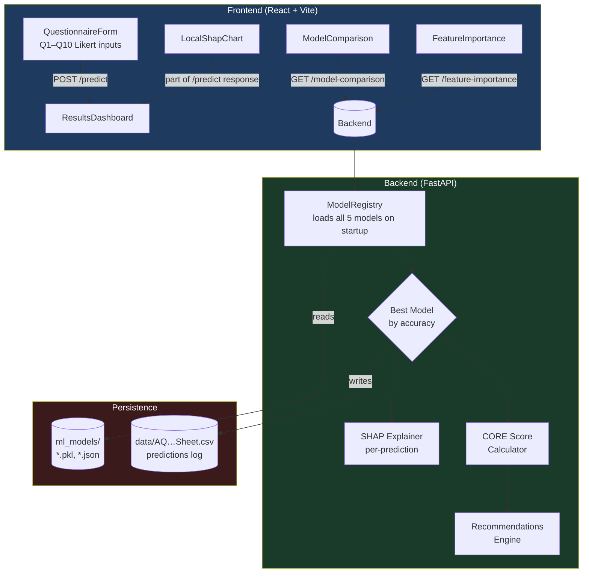
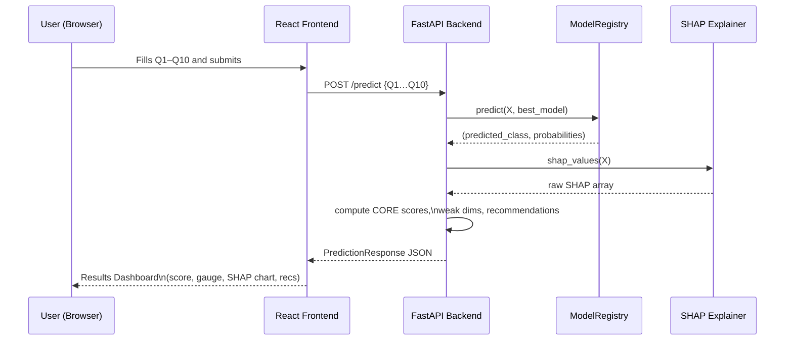
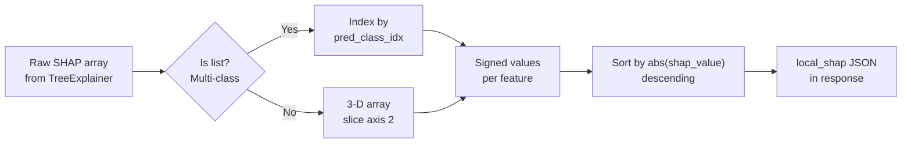
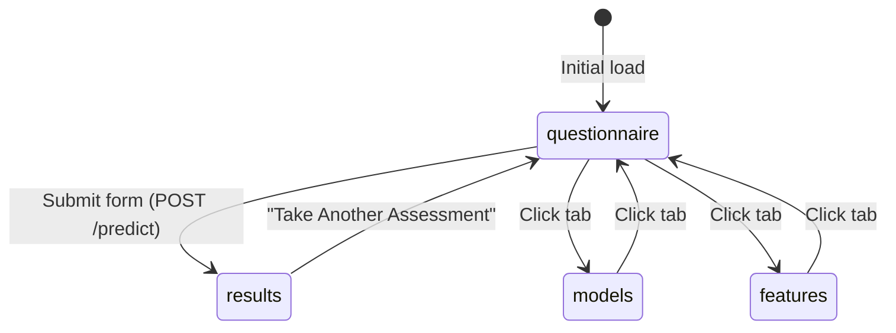
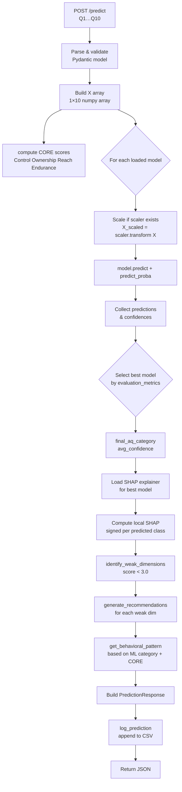

# AQ Prediction System — Comprehensive Project Documentation

> **Exploring the Adversity Quotient (AQ) of Adolescents: A Behavioural Pattern Analysis**

---

## Table of Contents

1. [Project Overview](#1-project-overview)
2. [System Architecture](#2-system-architecture)
3. [Folder Structure](#3-folder-structure)
4. [Dataset & Features](#4-dataset--features)
5. [CORE Dimensions (AQ Framework)](#5-core-dimensions-aq-framework)
6. [Target Variable & Class Distribution](#6-target-variable--class-distribution)
7. [Train/Test Split](#7-traintest-split)
8. [ML Models & Hyperparameters](#8-ml-models--hyperparameters)
9. [Model Evaluation Metrics](#9-model-evaluation-metrics)
10. [SHAP Explainability](#10-shap-explainability)
11. [Plots & Visualizations](#11-plots--visualizations)
12. [Backend API — Endpoints](#12-backend-api--endpoints)
13. [Frontend — Pages & Components](#13-frontend--pages--components)
14. [Model Artifacts](#14-model-artifacts)
15. [Prediction Pipeline (Runtime)](#15-prediction-pipeline-runtime)
16. [Personalized Recommendations](#16-personalized-recommendations)
17. [Data Logging](#17-data-logging)
18. [Tech Stack & Dependencies](#18-tech-stack--dependencies)
19. [Running the Project](#19-running-the-project)

---

## 1. Project Overview

This system predicts the **Adversity Quotient (AQ)** of adolescents from a 10-question self-report questionnaire. AQ measures how effectively a person responds to and deals with adversity.

The pipeline:
1. Collects 10 Likert-scale responses (1–5) from the user.
2. Computes CORE dimension scores (Control, Ownership, Reach, Endurance).
3. Runs five trained ML classifiers in parallel.
4. Returns the category (**Low / Medium / High** AQ), model confidence, SHAP explanations, weak dimensions, and personalised improvement recommendations.

---

## 2. System Architecture



### Request / Response Flow



---

## 3. Folder Structure

```
Mini_Project/
├── backend/
│   ├── main.py                   # FastAPI app + ModelRegistry
│   ├── requirements.txt
│   ├── data/
│   │   └── AQ of adoloscents - Sheet.csv   # Training data + prediction log
│   ├── ml_models/
│   │   ├── random_forest/
│   │   │   ├── random_forest_model.pkl
│   │   │   ├── shap_explainer.pkl
│   │   │   ├── X_train.pkl
│   │   │   ├── evaluation_metrics.json
│   │   │   └── feature_importance.json
│   │   ├── xgboost/
│   │   │   ├── xgboost_model.pkl
│   │   │   ├── scaler.pkl            # StandardScaler (XGBoost needs scaling)
│   │   │   ├── shap_explainer.pkl
│   │   │   ├── X_train.pkl
│   │   │   ├── evaluation_metrics.json
│   │   │   └── feature_importance.json
│   │   ├── logistic_regression/      # same structure
│   │   ├── decision_tree/            # same structure
│   │   └── svm/                      # same structure
│   ├── router/
│   │   ├── predict.py        # POST /predict
│   │   ├── models.py         # GET /model-comparison
│   │   ├── features.py       # GET /feature-importance
│   │   ├── dimensions.py     # GET /core-dimensions
│   │   └── health.py         # GET /health
│   └── utils/
│       └── csv_logger.py     # Appends predictions to CSV
│
├── frontend/
│   ├── index.html
│   ├── vite.config.js
│   ├── package.json
│   └── src/
│       ├── App.jsx            # Routing, dark mode, state management
│       ├── api/
│       │   └── service.js     # Fetch helpers (BASE_URL = localhost:8000)
│       ├── components/
│       │   ├── QuestionnaireForm.jsx
│       │   ├── ResultsDashboard.jsx
│       │   ├── CoreDimensions.jsx
│       │   ├── LocalShapChart.jsx
│       │   ├── FeatureImportance.jsx
│       │   ├── ModelComparison.jsx
│       │   ├── RecommendationCard.jsx
│       │   ├── Header.jsx
│       │   ├── LoadingSpinner.jsx
│       │   └── ErrorAlert.jsx
│       └── styles/
│           ├── App.css
│           └── DarkMode.css
│
└── notebooks/
    ├── random_forest.ipynb
    ├── xgboost.ipynb
    ├── logistic_regression.ipynb
    ├── decision_tree.ipynb
    └── svm.ipynb
```

---

## 4. Dataset & Features

| Property | Value |
|---|---|
| **File** | `backend/data/AQ of adoloscents - Sheet.csv` |
| **Total rows** | ~117 (grows with each prediction) |
| **Raw columns** | Q1, Q2, Q3, Q4, Q5, Q6, Q7, Q8, Q9, Q10 |
| **Derived columns** | CONTROL, OWNERSHIP, REACH, ENDURANCE, AQ, Target_Category |
| **Input scale** | 1–5 (Likert) |

### Question Descriptions

| Feature | Description | CORE Dimension |
|---|---|---|
| **Q1** | Influence on academic outcomes | Control |
| **Q2** | Recovery from disappointment | Ownership |
| **Q3** | Motivation without visible results | Reach |
| **Q4** | Failures don't define ability | Endurance |
| **Q5** | Learning from mistakes | Control |
| **Q6** | Control under pressure | Ownership |
| **Q7** | Problems are temporary | Reach |
| **Q8** | Confidence across subjects | Endurance |
| **Q9** | Taking responsibility | Control |
| **Q10** | Finding ways to overcome | Endurance |

---

## 5. CORE Dimensions (AQ Framework)

The AQ framework decomposes resilience into four CORE dimensions. Each is averaged from its constituent questions:

```
Control   = (Q1 + Q5 + Q9) / 3
Ownership = (Q2 + Q6) / 2
Reach     = (Q3 + Q7) / 2
Endurance = (Q4 + Q8 + Q10) / 3
AQ Score  = (Control + Ownership + Reach + Endurance) / 4
```

| Dimension | Questions | What it Measures |
|---|---|---|
| **Control** | Q1, Q5, Q9 | Belief in personal agency; can influence outcomes |
| **Ownership** | Q2, Q6 | Taking responsibility; learning from mistakes |
| **Reach** | Q3, Q7 | Preventing setbacks from spilling into other life areas |
| **Endurance** | Q4, Q8, Q10 | Believing problems are temporary; persistence |

---

## 6. Target Variable & Class Distribution

The AQ score is bucketed into three classes:

| Label | Numeric | Score Threshold |
|---|---|---|
| Low | 0 | AQ < 2.5 |
| Medium | 1 | 2.5 ≤ AQ < 3.5 |
| High | 2 | AQ ≥ 3.5 |

**Class Distribution (training set):**

| Class | Count |
|---|---|
| High AQ | 96 |
| Low AQ | 11 |
| Medium AQ | 10 |

> [!NOTE]
> The dataset is **heavily imbalanced** — High AQ dominates. Models that use `class_weight='balanced'` (Random Forest, Logistic Regression) and `scale_pos_weight` strategies compensate for this.

---

## 7. Train/Test Split

All five models use the same split strategy:

```python
X_train, X_test, y_train, y_test = train_test_split(
    X, y,
    test_size=0.2,
    random_state=42,
    stratify=y          # preserves class proportions in both splits
)
```

| Split | Size |
|---|---|
| Training | 93 samples (80%) |
| Test | 24 samples (20%) |

**Training class distribution:**

| Class | Count |
|---|---|
| Low (0) | 9 |
| Medium (1) | 8 |
| High (2) | 76 |

**Cross-validation:** 5-fold CV on the full dataset (scoring = accuracy) is used alongside the hold-out test set for robust evaluation.

---

## 8. ML Models & Hyperparameters

### 8.1 Random Forest

```python
RandomForestClassifier(
    n_estimators   = 150,          # 150 trees in the ensemble
    max_depth      = 8,            # max tree depth
    min_samples_split = 2,         # min samples to split a node
    min_samples_leaf  = 1,         # min samples in a leaf
    random_state   = 42,
    class_weight   = 'balanced'    # compensates for class imbalance
)
```

> **Scaling:** Not required (tree-based model). Raw Q1–Q10 values fed directly.

---

### 8.2 XGBoost

```python
XGBClassifier(
    n_estimators      = 150,       # number of boosting rounds
    max_depth         = 8,         # max depth of each tree
    learning_rate     = 0.03,      # step-size shrinkage (eta)
    subsample         = 0.8,       # fraction of samples per tree
    colsample_bytree  = 0.8,       # fraction of features per tree
    use_label_encoder = False,
    eval_metric       = 'mlogloss',  # multi-class log loss
    random_state      = 42
)
```

> **Scaling:** Uses `StandardScaler` (fitted on train, applied to test). A `scaler.pkl` is saved alongside the model.

---

### 8.3 Logistic Regression

```python
LogisticRegression(
    C             = 1.0,           # inverse regularisation strength
    max_iter      = 1000,          # solver iterations
    solver        = 'lbfgs',
    multi_class   = 'multinomial', # native multi-class
    class_weight  = 'balanced',
    random_state  = 42
)
```

> **Scaling:** Uses `StandardScaler`. A `scaler.pkl` is saved.

---

### 8.4 Decision Tree

```python
DecisionTreeClassifier(
    max_depth         = 5,         # shallower to reduce overfitting
    min_samples_split = 5,
    min_samples_leaf  = 2,
    class_weight      = 'balanced',
    random_state      = 42
)
```

> **Scaling:** Uses `StandardScaler` for consistency, though trees are scale-invariant.

---

### 8.5 Support Vector Machine (SVM)

```python
SVC(
    C        = 1.0,
    kernel   = 'rbf',
    gamma    = 'scale',
    probability = True,            # needed for predict_proba
    class_weight = 'balanced',
    random_state = 42
)
```

> **Scaling:** Requires `StandardScaler`. Saved as `scaler.pkl`.

---

## 9. Model Evaluation Metrics

All metrics are computed on the held-out **test set (20%)**, plus 5-fold CV accuracy on the full dataset.

| Model | Accuracy | F1 (weighted) | AUC-ROC (OVR) | CV Mean | CV Std |
|---|---|---|---|---|---|
| **Random Forest** | **95.83%** | **95.19%** | 97.54% | 91.49% | ±2.58% |
| **XGBoost** | **95.83%** | **95.19%** | **98.77%** | 91.41% | ±2.58% |
| **Logistic Regression** | 91.67% | 91.67% | 98.77% | **92.25%** | **±1.71%** |
| **SVM** | 91.30% | 91.30% | 98.71% | 91.23% | ±0.16% |
| **Decision Tree** | 79.17% | 83.47% | 90.34% | 79.35% | ±6.81% |

> [!IMPORTANT]
> The **best model** is selected at runtime by comparing `accuracy → f1_score → auc_roc → cv_mean` (descending) and `-cv_std` (ascending — prefer stability). Random Forest or XGBoost typically win and are used for the final prediction.

### Global SHAP Feature Importance (Random Forest — Top 10)

| Rank | Feature | Importance |
|---|---|---|
| 1 | Q5 — Learning from mistakes | 0.0610 |
| 2 | Q6 — Control under pressure | 0.0579 |
| 3 | Q8 — Confidence across subjects | 0.0571 |
| 4 | Q2 — Recovery from disappointment | 0.0546 |
| 5 | Q7 — Problems are temporary | 0.0510 |
| 6 | Q3 — Motivation without visible results | 0.0457 |
| 7 | Q9 — Taking responsibility | 0.0404 |
| 8 | Q10 — Finding ways to overcome | 0.0362 |
| 9 | Q4 — Failures don't define ability | 0.0226 |
| 10 | Q1 — Influence on academic outcomes | 0.0210 |

---

## 10. SHAP Explainability

Two layers of SHAP are computed:

### 10.1 Global Feature Importance (Static)

- Computed during training via `shap.TreeExplainer`.
- Stored in `feature_importance.json` as mean |SHAP| across training samples.
- Served by `GET /feature-importance`.
- Displayed in the **"Global SHAP Feature Importance"** tab.

### 10.2 Local SHAP (Per Prediction)

- Computed at inference time from the saved `shap_explainer.pkl`.
- Shows **signed SHAP values** for the predicted class only.

```python
pred_class_idx = {v: k for k, v in class_mapping.items()}.get(final_aq_category, 2)
if isinstance(raw_shap, list):
    signed_vals = raw_shap[pred_class_idx][0]   # [n_classes][n_samples][n_features]
```

- Positive value → pushes toward predicted AQ category.
- Negative value → pushes away from predicted AQ category.
- Displayed as a **waterfall bar chart** in the Results tab.



---

## 11. Plots & Visualizations

Each Jupyter notebook generates the following plots:

### Notebook Plots (Training Phase)

| Plot | Description |
|---|---|
| **Class Distribution Bar Chart** | Shows count of Low / Medium / High AQ samples |
| **Confusion Matrix** | Heatmap of predictions vs ground truth |
| **SHAP Summary Plot** | Beeswarm of SHAP values across all features |
| **SHAP Bar Chart** | Mean |SHAP| ranked by feature importance |
| **Decision Tree Diagram** | (DT notebook only) Full tree visualized via `sklearn.tree.plot_tree` |
| **ROC Curve** | One-vs-Rest multi-class ROC |
| **Feature Importance Bar** | Gini impurity importance (tree models) |

### Frontend Visualizations (Runtime)

| Component | Visualization |
|---|---|
| **AQ Gauge** | Conic-gradient donut ring showing AQ score |
| **CORE Dimensions Grid** | 4 radial/progress bars for C-O-R-E scores |
| **Local SHAP Waterfall** | Horizontal bar chart: positive (green) = pushes toward class, negative (red) = pushes away |
| **Global SHAP Rankings** | Ranked list with proportional bars; top-3 highlighted with insight text |
| **Model Comparison Table** | Accuracy, F1, AUC-ROC, CV mean/std across all 5 models |
| **Weak Dimensions Cards** | Current score, target (3.5), gap for each dimension below threshold |

---

## 12. Backend API — Endpoints

**Base URL:** `http://localhost:8000`

### `GET /health`
Returns backend status and loaded model count.

---

### `POST /predict`

**Request body:**
```json
{
  "Q1": 4, "Q2": 3, "Q3": 5, "Q4": 4, "Q5": 4,
  "Q6": 3, "Q7": 5, "Q8": 4, "Q9": 3, "Q10": 4
}
```

**Response:**
```json
{
  "aq_category": "High",
  "aq_score": 3.92,
  "confidence": 0.94,
  "core_scores": {"Control": 3.67, "Ownership": 3.0, "Reach": 5.0, "Endurance": 4.0},
  "model_predictions": {"Random Forest": "High", "XGBoost": "High", ...},
  "model_confidences": {"Random Forest": 0.94, ...},
  "feature_importance": [
    {"question": "Q5", "importance": 0.061, "rank": 1},
    ...
  ],
  "local_shap": [
    {"feature": "Q5", "shap_value": 0.12, "direction": "pushes toward High AQ"},
    ...
  ],
  "weak_dimensions": [
    {"dimension": "Ownership", "score": 3.0, "severity": "Moderate", "target_score": 3.5, "improvement_needed": 0.5}
  ],
  "behavioral_pattern": "HIGHLY RESILIENT: ML Prediction confirms excellent resilience. Strongest dimension: Reach...",
  "recommendations": [
    {
      "Dimension": "Ownership",
      "Priority": "Moderate",
      "Suggestion": "Build responsibility and learning from mistakes",
      "Actions": ["After each test, do a 10-minute reflection", ...]
    }
  ]
}
```

---

### `GET /model-comparison`

Returns metrics for all 5 models plus the best model name.

```json
{
  "algorithms": [
    {"model_name": "Random Forest", "accuracy": 0.9583, "f1_score": 0.9519, "auc_roc": 0.9754, "cv_mean": 0.9149, "cv_std": 0.0258},
    ...
  ],
  "best_model": "XGBoost",
  "best_accuracy": 0.9583
}
```

---

### `GET /feature-importance`

Returns global SHAP importance ranked for all 10 features.

```json
{
  "features": [
    {"feature": "Q5", "importance": 0.061, "rank": 1},
    ...
  ],
  "total_features": 10,
  "interpretation": {"Q5": "Control response under pressure - Rank #1", ...}
}
```

---

### `GET /core-dimensions`

Returns definitions and improvement tips for each CORE dimension.

---

## 13. Frontend — Pages & Components

The single-page React app has **4 tabs** controlled by `activeTab` state:



### Tab: Questionnaire
**Component:** `QuestionnaireForm.jsx`
- 10 Likert-scale radio groups (1–5).
- Labelled with descriptive question text.
- Submits via `handlePredict` → `POST /predict`.

### Tab: Results (post-prediction)
**Component:** `ResultsDashboard.jsx` and sub-components:

| Sub-component | Purpose |
|---|---|
| `CoreDimensions.jsx` | Renders C-O-R-E score cards |
| `LocalShapChart.jsx` | Signed SHAP waterfall chart |
| `RecommendationCard.jsx` | One card per weak dimension |
| Weak Dimensions section | Current/target/gap for dims < 3.0 |
| Behavioral Pattern | Text block from `get_behavioral_pattern()` |
| Export buttons | Print / Download JSON |

### Tab: Models
**Component:** `ModelComparison.jsx`
- Loaded on startup via `GET /model-comparison`.
- Table + bar chart comparing all 5 models.

### Tab: Feature Importance (Global SHAP)
**Component:** `FeatureImportance.jsx`
- Loaded on startup via `GET /feature-importance`.
- Ranked list with proportional bars.
- Top-3 features show an insight blurb.

---

## 14. Model Artifacts

Each model subdirectory under `backend/ml_models/` contains:

| File | Description | Present In |
|---|---|---|
| `*_model.pkl` | Serialised sklearn/XGBoost model | All 5 |
| `scaler.pkl` | `StandardScaler` fitted on X_train | XGBoost, LR, SVM, DT |
| `shap_explainer.pkl` | `shap.TreeExplainer` or `KernelExplainer` | All 5 |
| `X_train.pkl` | Training feature matrix (used for SHAP background) | All 5 |
| `evaluation_metrics.json` | `[{model_name, accuracy, f1_score, auc_roc, cv_mean, cv_std}]` | All 5 |
| `feature_importance.json` | `[{feature, importance, rank}]` (sorted desc) | All 5 |

### ModelRegistry (`main.py`)

On startup the `ModelRegistry` class:
1. Iterates `ml_models/` subdirectories alphabetically.
2. Reads `evaluation_metrics.json` to get `model_name`.
3. Loads `*_model.pkl` → `self.models[model_name]`.
4. Optionally loads `scaler.pkl`, `shap_explainer.pkl`, `X_train.pkl`.
5. Extends `self.evaluation_metrics` list.
6. Stores the **first found** `feature_importance.json` as the global default.

---

## 15. Prediction Pipeline (Runtime)



---

## 16. Personalized Recommendations

Recommendations are generated for every CORE dimension that falls **below 3.0**. Severity is assigned as:

| Score | Severity |
|---|---|
| score < 2.0 | Critical |
| 2.0 ≤ score < 2.5 | High |
| 2.5 ≤ score < 3.0 | Moderate |

Each recommendation includes:
- **Dimension** (Control / Ownership / Reach / Endurance)
- **Priority** (maps from severity)
- **Suggestion** — a one-line improvement goal
- **Actions** — 3 concrete, actionable steps

### Recommendation Templates

| Dimension | Suggestion | Example Actions |
|---|---|---|
| Control | Develop personal agency through small wins | Set 3 small achievable academic goals weekly; Practice positive self-talk; Seek mentorship |
| Ownership | Build responsibility and learning from mistakes | After each test, 10-min reflection; Identify 1 area to improve; "Next time I will…" plan |
| Reach | Build resilience in self-concept | Practice positive identity statements daily; Compartmentalize failures as specific events |
| Endurance | Build persistence and long-term motivation | Break goals into 2–4 week milestones; Track progress; Find peers with similar goals |

---

## 17. Data Logging

Every successful prediction is **appended** to `backend/data/AQ of adoloscents - Sheet.csv` via `utils/csv_logger.py`:

| Column | Description |
|---|---|
| Q1–Q10 | Raw Likert responses |
| CONTROL | Computed control score |
| OWNERSHIP | Computed ownership score |
| REACH | Computed reach score |
| ENDURANCE | Computed endurance score |
| AQ | Composite AQ score |
| Target_Category | Numeric class (0=Low, 1=Medium, 2=High) |

> [!WARNING]
> This grows the CSV file used for training. Retraining after enough new data accumulates would improve model performance over time.

---

## 18. Tech Stack & Dependencies

### Backend

| Package | Purpose |
|---|---|
| `fastapi` | REST API framework |
| `uvicorn` | ASGI server |
| `pydantic` | Request/response validation |
| `scikit-learn` | RF, LR, SVM, DT models + StandardScaler |
| `xgboost` | XGBoost classifier |
| `joblib` | Model serialization |
| `numpy` | Numeric operations |
| `pandas` | Data manipulation (notebooks) |
| `shap` | SHAP explainability |
| `seaborn` / `matplotlib` | Training visualizations (notebooks) |

### Frontend

| Package | Purpose |
|---|---|
| `react` 18 | UI framework |
| `vite` | Dev server + bundler |
| Vanilla CSS | Styling (no Tailwind) |
| `fetch` API | HTTP calls to backend |

---

## 19. Running the Project

### Backend

```bash
cd backend
pip install -r requirements.txt
uvicorn main:app --reload --host 0.0.0.0 --port 8000
```

The API is now at `http://localhost:8000`.
Interactive docs: `http://localhost:8000/docs`

### Frontend

```bash
cd frontend
npm install
npm run dev
```

The app runs at `http://localhost:5173` (default Vite port).

### Retraining Models

Run each Jupyter notebook in `notebooks/`:

```bash
cd notebooks
jupyter notebook random_forest.ipynb      # etc.
```

Each notebook:
1. Loads the CSV from `../backend/data/`.
2. Splits into 80/20 train/test (stratified, seed 42).
3. Trains the model.
4. Evaluates accuracy, F1, AUC-ROC, 5-fold CV.
5. Saves all artifacts to `../backend/ml_models/<model_name>/`.

> [!TIP]
> Train all 5 notebooks before starting the backend to ensure all models are available for ensemble comparison.
